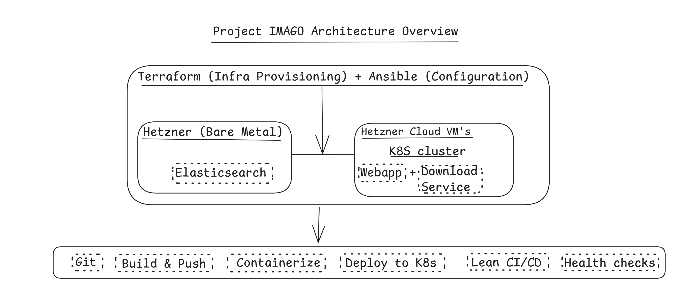

# Project IMAGO

High level Architecture



## Table of Contents

1. [Assumptions](#assumptions)
2. [Key Decisions](#key-decisions)
   - [Hybrid Infrastructure Model](#hybrid-infrastructure-model)
   - [Kubernetes as Core Platform](#kubernetes-as-core-platform)
   - [Infrastructure as Code (IaC)](#infrastructure-as-code-iac)
   - [Networking](#networking)
3. [Observability & Monitoring](#observability--monitoring)
4. [Migration Strategy](#migration-strategy)
5. [CI/CD Strategy](#cicd-strategy)
6. [Security Considerations](#security-considerations)
7. [Trade-offs](#trade-offs)
8. [Future Improvements](#future-improvements)

## Assumptions

To scope this solution, the following assumptions were made:

- **Traffic:** Moderate but growing (10k–100k daily users)
- **Workload:** Media-heavy workloads with large file transfers
- **Availability:** Target 99.9% uptime
- **Environments:** dev, staging, production
- **Platform constraints:** Runs on Hetzner Cloud and bare metal infrastructure
- **Legacy support:** Some legacy Windows systems must remain temporarily
- **Team model:** Multiple engineering teams need self-service deployments
- **Security:** Media delivery must be authenticated and secure

## Key Decisions

### Hybrid Infrastructure Model

- **Cloud:** Hetzner Cloud for stateless workloads and Kubernetes cluster nodes
- **Bare metal:** Elasticsearch for performance and disk I/O, plus storage-heavy workloads
- **Reason:** Balance cost efficiency with performance

### Kubernetes as Core Platform

- All new services run on Kubernetes (K8s)
- Deploy using Helm or Kustomize
- Enables standardized deployments, autoscaling, and self-service for teams

#### Service Deployment Model

| Service        | Type          | Notes                    |
| -------------- | ------------- | ------------------------ |
| Web App        | Stateless     | Horizontally scalable    |
| Media Search   | Stateless     | Talks to Elasticsearch   |
| Media Download | Semi-stateful | Handles auth + streaming |
| Elasticsearch  | Stateful      | Runs on bare metal       |

### Infrastructure as Code (IaC)

- **Terraform:** Infrastructure provisioning
- **Ansible:** Configuration management for legacy systems and bare metal
- **Helm:** Kubernetes deployments

#### Infra Repo Structure

```text
infrastructure/
├── modules/
│   ├── network/
│   ├── kubernetes/
│   ├── loadbalancer/
│   └── baremetal/
├── environments/
│   ├── dev/
│   ├── staging/
│   └── prod/
```

### Networking

- Ingress controller: NGINX or Traefik
- Internal service communication via Kubernetes networking
- Private network connectivity between cloud and bare metal environments

## Observability & Monitoring

### Stack

- Prometheus → metrics
- Grafana → dashboards
- Loki → logs
- Alertmanager → alerting

### Monitoring Focus

- **Infrastructure:** CPU, memory, disk, network traffic
- **Application:** request latency, error rates, throughput
- **Elasticsearch:** query latency, cluster health, disk usage

## Migration Strategy

### Current State Challenges

- Manual infrastructure provisioning
- Mixed OS environment (Linux + Windows)
- No standard deployment process

### Step-by-Step Migration Plan

1. **Phase 1: Visibility First**
   - Add monitoring to existing systems
   - Avoid disruption
   - **Why:** You can’t improve what you can’t see
2. **Phase 2: IaC for New Resources**
   - Require Terraform for all new infrastructure
   - Eliminate manual provisioning
3. **Phase 3: Containerize New Services**
   - Deploy new services to Kubernetes
   - Keep legacy services in place temporarily
4. **Phase 4: Gradual Migration**
   - Migrate services one by one
   - Web App first (stateless), then Search, and Download last

### Windows + Linux Coexistence

- Retain Windows only where required
- Manage Windows using Ansible with WinRM
- Gradually replace Windows systems with Linux where possible

## CI/CD Strategy

### Goals

- Automated deployments
- Repeatable environments
- Fast feedback

### Pipeline Example

Stages:

- Build
- Test
- Security scan
- Deploy to staging
- Manual approval
- Deploy to production

## Security Considerations

- Private networking
- IAM/RBAC in Kubernetes
- Secrets management (Vault later)

## Trade-offs

| Decision           | Trade-off                                    |
| ------------------ | -------------------------------------------- |
| Kubernetes         | Added complexity vs. flexibility              |
| Hybrid infrastructure | Operational overhead vs. cost/performance |
| Gradual migration  | Slower migration pace vs. reduced risk       |
